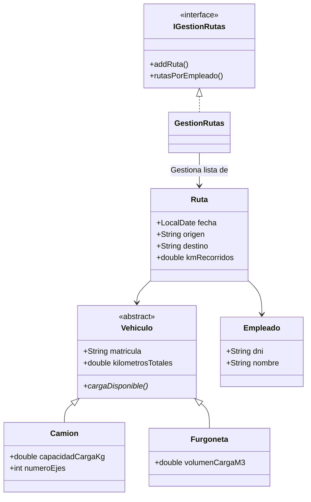

# Actividad: Gestión de Rutas de Logística

Este proyecto implementa un sistema para la gestión de rutas de transporte, controlando vehículos, empleados y asignaciones de rutas.

## Descripción del Proyecto

La aplicación permite administrar una flota de vehículos (Camiones y Furgonetas) y a los empleados encargados de realizar rutas de transporte. Se gestiona la creación de rutas, asignación de vehículos y conductores, y el cálculo de métricas como consumo, carga y kilometraje.

## Estructura de Clases

El modelo de datos se basa en las siguientes clases:

### Modelo de Datos (`modelos_javabean`)

*   **`Vehiculo` (Abstracta)**: Clase base para todos los vehículos.
    *   Atributos: `matricula`, `marca`, `modelo`, `kilometrosTotales`, `consumoLitros100km`.
    *   Métodos abstractos: `cargaDisponible()`, `getPorcentajeCarga()`, `isLleno()`.
*   **`Camion` (Extiende `Vehiculo`)**:
    *   Atributos: `capacidadCargaKg`, `cargaOcupadaKg`, `numeroEjes`.
    *   Sobrescribe métodos abstractos basándose en peso (Kg).
*   **`Furgoneta` (Extiende `Vehiculo`)**:
    *   Atributos: `volumenCargaM3`, `volumenOcupadoM3`.
    *   Sobrescribe métodos abstractos basándose en volumen (m³).
*   **`Empleado`**:
    *   Representa a un conductor/empleado.
    *   Atributos: `dni`, `nombre`, `apellidos`, `email`, `genero`.
*   **`Ruta`**:
    *   Relaciona un `Vehiculo` y un `Empleado` en una fecha y trayecto específicos.
    *   Atributos: `fecha`, `origen`, `destino`, `kmRecorridos`, `cargaTransportadaKg`.
    *   Funcionalidad: Calcular consumo estimado, validar carga correcta según el vehículo.

### Capa de Acceso a Datos (`modelos_dao` e `interfaces`)

*   **`IGestionRutas`**: Interfaz que define el contrato para la gestión de rutas.
*   **`GestionRutas`**: Implementación de `IGestionRutas` usando un `ArrayList` en memoria.
    *   Métodos principales:
        *   `addRuta`, `eliminarRuta`.
        *   Búsquedas: `rutasPorEmpleado`, `rutasPorVehiculo`, `rutasPorDestino`, `rutasIntervaloFechas`.
        *   Estadísticas: `totalKmPorVehiculo`, `totalKmPorTipoVehiculo`.

## Diagrama de Clases (Simplificado)

## Funcionalidad Principal

1.  **Polimorfismo en Vehículos**: Camiones y Furgonetas calculan su carga de forma diferente (peso vs volumen), pero son tratados uniformemente como `Vehiculo`.
2.  **Validaciones**: Se aseguran datos coherentes en los setters (DNI válido, rangos de carga, kilometraje positivo).
3.  **Gestión de Rutas**: Permite operar sobre el conjunto de rutas para extraer información útil para la logística (km totales, rutas por fecha, etc.).
